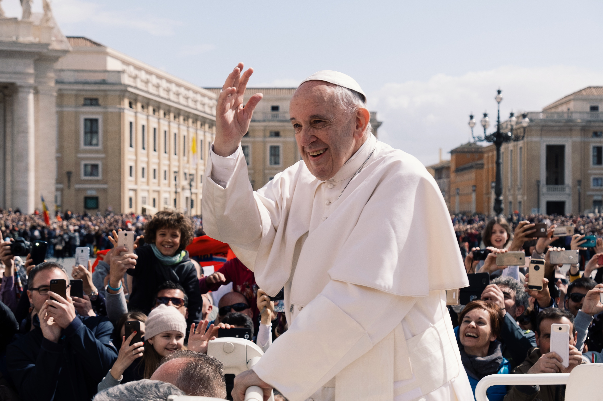
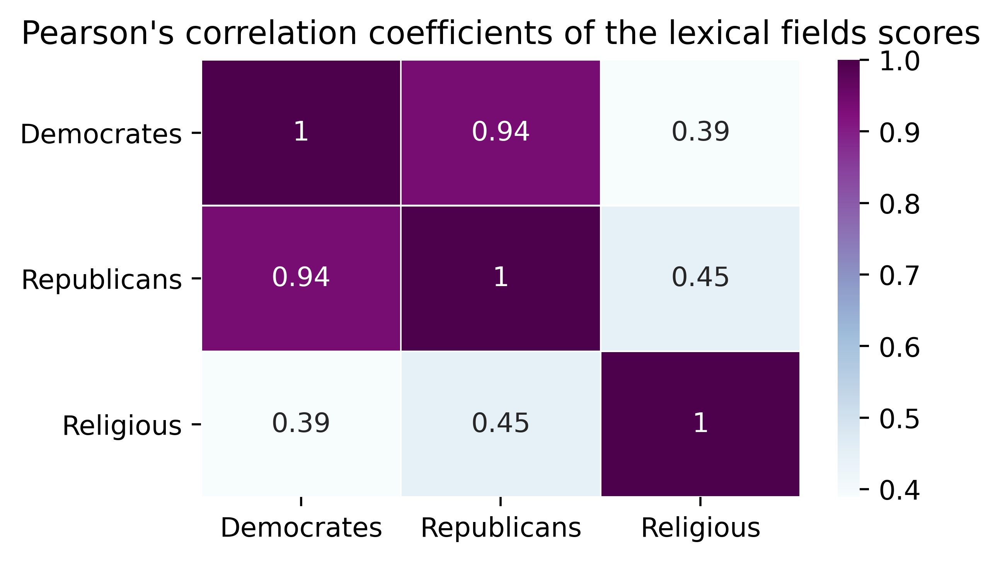
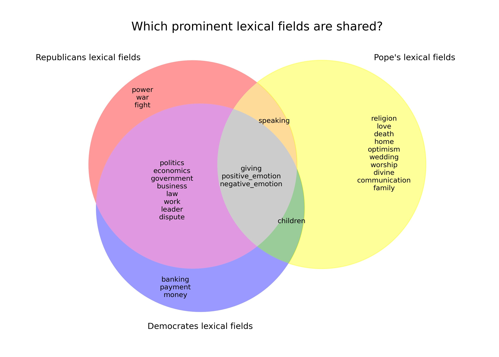
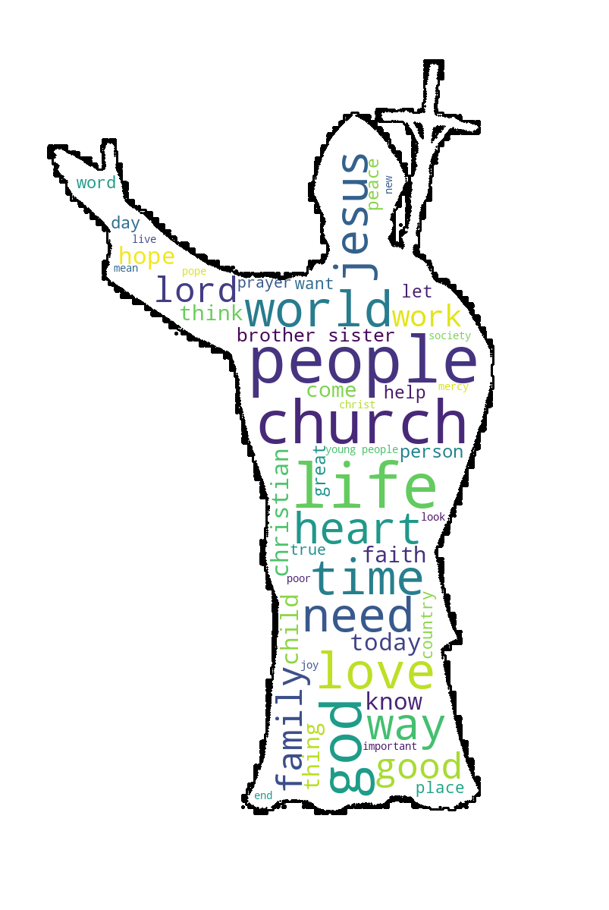
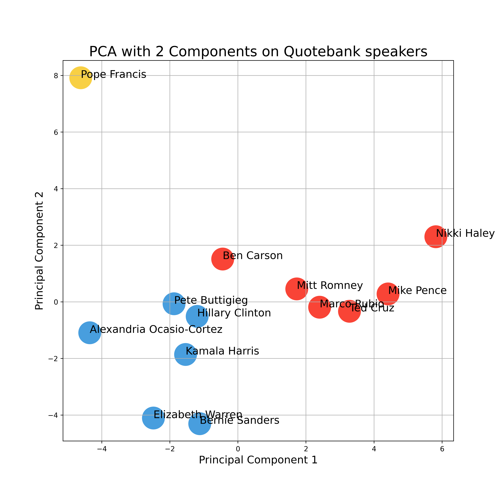
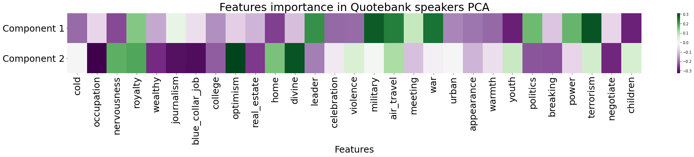
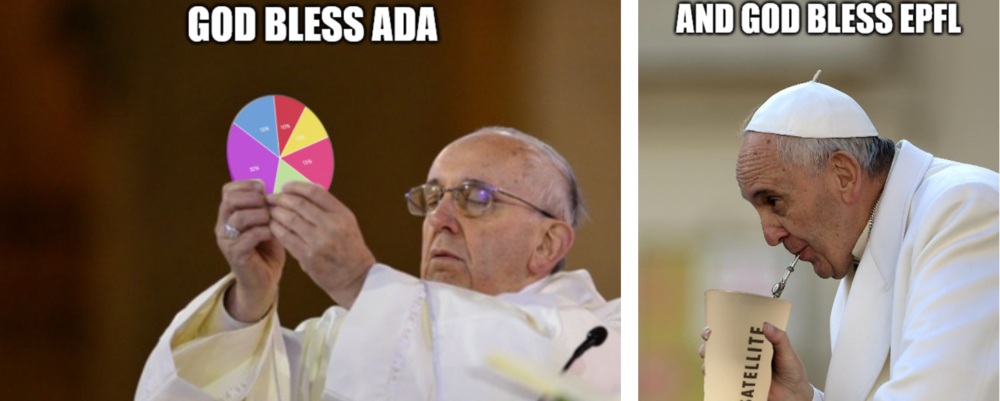

At first glance, one might think that the pope does not have much impact on our everyday life and on our country’s politics, yet his opinion affects over 1.3 billion Catholics worldwide and he regularly meets with the most powerful political figures of the planet. Here, we want to investigate how one of the mightiest apolitical figures on Earth influences one sixth of the world population by using a novel quotations corpus : **Quotebank**. 

  
Our main approach consists in placing the pope on the American political spectrum, alongside to a few emblematic Democrats and Republicans politicians, by extracting meaningful features from the quote corpus of each of our selected speakers. More precisely, we focused on analysing how important key topics such as politics, economics, war and religion were to our speakers by looking at the prominent lexical fields present in their statements.
 
## Why the American political spectrum?

We chose to place the pope on the **American bipartite political spectrum** which comprises at its two ends the Democratic Party and the Republican Party. This spectrum is particularly suited for our analysis, first, because the Quotebank corpus main language is English which means that a significant portion of the quotes originate from american politicians and secondly because choosing a binary spectrum greatly simplifies our analysis.
  
We divided our speakers into three categories: **Democrats**, **Republicans** and the **pope**. Here we briefly summarize which speakers we chose to integrate into our analysis and the number of their citations that appear in the Quotebank data sets between 2015 and 2020.

| Political figure | Party      |Number of quotations |  |Political figure | Party      |Number of quotations |  
|------------------|------------|----------------------| |------------------|------------|----------------------| 
| Elizabeth Warren | Democratic | 48'397               | | Ted Cruz         | Republican| 46'301               |
| Bernie Sanders   | Democratic | 84'018               | |Marco Rubio      | Republican| 41'650               |
| Hillary Clinton  | Democratic | 95'458               | | Mike Pence       | Republican| 46'893               | 
|Kamala Harris    | Democratic | 19'091               |  |Ben Carson     | Republican| 22'448                 |
|Pete Buttigieg   | Democratic | 24'523              |   | Mitt Romney      | Republican| 10'651               |
|Alexandria Ocasio-Cortez  | Democratic | 18'653     |   |Nikki Haley     | Republican| 24'533               |   
| Pope Francis        | Apolitical| 102'993          |
  

## What topics do they like to talk about? 
  
We begin our investigation by looking at how our three categories of speakers choose their words and what topics they fancy talking about the most. To do so, we analyzed the prevalence, summarized by a mean score, of 200 distinct lexical fields within the quotation corpus of our three categories:

Those first results make a lot of sense as they show that our two political categories often talk about *government*, *business*, *leader*, *politics* and *law* while the pope prefers to talk about *religion*, *divine* and *worship*-related topics. As an example, the *worship* lexical field score increases when the pope uses words such as : "pray", "lord", "bless", "glory" or "cult". At the bottom of the graph, we find the most rarely used lexical fields with notably the *exotic*, *smell* and *ugliness* lexical fields. We can also note that the pope is a true saint as he never uses swearing words!

## Do they talk about similar topics?

As a next analysis, we wanted to determine the extent to which the use of lexical fields was similar or different between our three groups. One first simple idea consisted in computing the correlation matrix (Pearson's correlation coefficient) of the 200 mean lexical fields scores of our three categories.

 

The lexical fields scores of the Republicans and Democrats are very strongly correlated (0.94). This could be due to the fact that even though the two parties have different opinions, they allocate similar importance to the same topics. On the other hand, the pope's lexical fields scores correlate more modestly with those of of the Democrats and Republicans. From this measure, he appears to be slightly closer to the Republicans (0.45) than to the Democrats (0.39).  

We then decided to focus on the 15 most prominent lexical fields of our three categories, removed the dupplicates and compared their relative use:



As we can see, the pope seems to leave political topics such as *government*, *business*, *politics*, *leader*, *law*, *money*, *banking*, *dispute* and *payment* to the real politicians. As the head of the Church, he is logically more commonly refering to religion-related topics such as *worship*, *religion*, *love*, *divine*, *death* and *wedding* than the politicians. Interestingly, the lexical fields *family*, *children*, *home*, *positive emotions* and *optimism* are also dominated by the pope. Concerning the *family*, *children* and *home* lexical fields, it might be due to the fact that the pope uses the terms "brother", "sister", "father", "mother" and "son" a lot, even though he barely uses the litteral meaning of those terms. Concerning the *optimism* and *positive emotions* lexical fields, they include terms like "compassion", "forgiveness", "love", "kindness", "hope" and "faith" which can all be seen as Christian values.

Alternatively, we present here the same results as in the previous graph for a hand-picked selection of lexical fields using a radio chart in order to emphasize how different the profile of the Pope is in comparison with the profiles of the Democrats and Republicans.



We also wanted to visualize which of the 15 most common lexical fields of our three categories are shared. To do so, we built the following Venn diagram:

We immediately notice that the two politcal parties share most of their lexical fields, which are all politics-related, while the pope stands out much more. The only lexical fields that are shared by our politicians and by the pope are: *giving* (which includes words like "give", "need", "offer", "fund", "donate", "sacrifice" and "pay"), *positive emotions* and *negative emotions*. Interestingly, none of those three lexical fields is really related to politics. Then, we can observe that the pope shares the *children* lexical field with the Democrats, which may arise from the Democrats' more social values. We can also see that the pope-specific lexical fields all concerns religious topics (*religion*, *worship*, *divine*, *wedding*, *death*) and human-oriented topics (*family*, *home*, *love*, *communication*, *optimism*). Those key topics are coherent with the pope's role as the head of the Catholic Church and considering how the catholic faith rythms the most important life events of its followers: baptism at birth, the marriage sacrament and the last rites on one's deathbed.

## What does the pope say? 

We were also interested by the way the pope expresses himself. First, we compiled his most commonly used words, their size corresponding to their frequency of occurence, outside of stop words such as "the', "and" or "but" :

 

We can appreciate how those words are coherent with our previous lexical fields results. 

Next, we were also curious to see how the pope's lexical fields co-occur within his statements. To do so, we counted the times when each pair of lexical fields co-occured within one of the pope's 100'000 quotes and visualized the most common pairs with a network plot. In the following figure, each node is one lexical field, the node size correspond to the overall importance of the lexical field along the pope's corpus and finally the edges widths correspond to the frequency of co-occurence of a pair of lexical fields: the larger, the more frequent. To produce a more readable plot, we only show the co-occurences that happened at least 5'000 times. The most important pair (*worship* and *divine*) can be found in one quarter of the pope's quotes.

 

The lexical fields that co-occur the most frequently are the religous ones: *worship*, *divine* and *religion*. Then we can see that the family-related lexical fields (*family*, *children*, *home*) co-occur together pretty often while the positive emotions related fields (*positive emotions*, *optimism*, *love*) co-occur together too. Moreover, it seems that the lexical fields of *positive emotions*, *worship* and *divine* act like hub nodes and connect several of the other fields which mean that those topics are quite central in the pope's language. Finally, we can also notice that all the politics-related topics (*leader*, *business*, *politics*, *government*, ...), besides appearing quite rarely in the pope's statements, barely co-occur with any of the pope's other lexical fields. In other words, the pope does not seem to disguise political opinions as religious statements.

## Can we place the pope on a political spectrum?

Our main approach to place the pope on the american political spectrum consisted in applying a dimensionality reduction method on several meaningful features extracted from the quotes corpus of each of our spearkers of interest. Initially, we extracted more than 200 features related to the lexical fields usage, vocabulary richness and personnal pronouns usage for each speakers. After feature selection, only 29 features were kept and used to perform a principal component analysis (PCA):

The obtained results are interesting for several reasons:
* All the politicians are more or less aligned along one single spectrum
* Democrats and Republicans are nicely separated
* The pope is far away from all politicians
* Principal component 1 is nicely capturing the Democrats vs Republicans spectrum
* Principal component 2 seems to capture the pope's uniqueness

Then we moved on interpreting more precisely what our two principal components capture:

We can observe that our first component discriminates the Republicans from the Democrats by capturing the scores of lexical fields such as *terrorism* and *military* for the Republican side, and *youth* and *children* for the Democrats side. Along this specific axis, the pope is placed in a central position. 

Our second component discriminates the pope from the politicians notably by capturing the scores of the lexical fields *divine* and *optimism* for the pope side, and the scores of the lexical fields *politics*, *blue collar jobs*, *occupation* and *leader* for the politicians side. In other words, this component differentiates the pope from the rest of the speakers by his extensive use of religious terms and by his rare use of political terms. For example the lexical fields *blue collar jobs*, *occupation* and *politics* include terms like "retirement", "employment", "job", "worker", "salary", "nation", "democracy" or "election".

## Conclusion

We can determine from our analysis that even though the pope shares some traits with both political parties, he does not appear to talk like a true politician from the America political spectrum. However, this does not mean that he has no influence on societal and political issues. Indeed, our approach is not bullet-proof as a quote can have a low score for the politics-related lexical fields but still present a strong political opinion. For example, when the pope speaks about an issue like abortion:

> "It is horrific even to think that there are children, victims of abortion, who will never see the light of day."

For this quote, the detected lexical fields are *horror*, *health*, *suffering*, *fire* and *torment*. These categories are not directly related to politics but we cannot minimize the decisive influence that the pope has on the abortion ban in countries with an important catholic population.

In conclusion, we can ask whether an analysis based on quotes relayed by the press allows for an accurate analysis of a speaker. Indeed, there may be a journalistic bias towards polemic and sensationalist quotes to increase the website viewership. Therefore, it is possible that the quotes from the Quotebank dataset do not always faithfully represent their authors opinions.

### One last word

 
